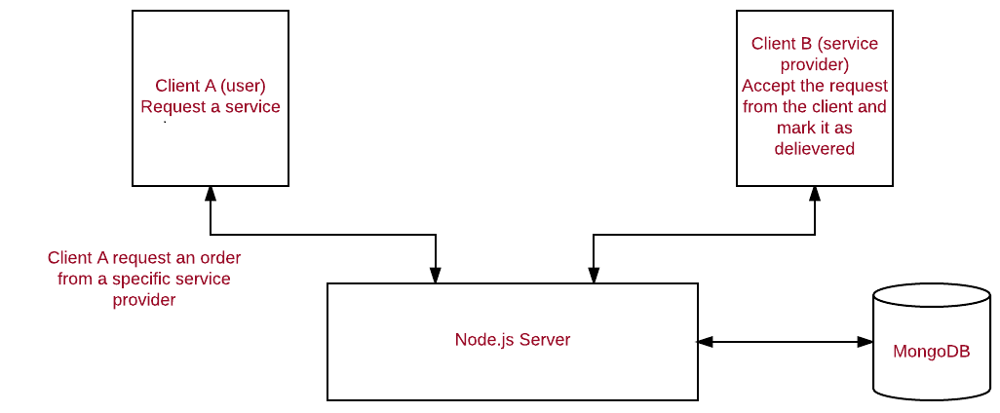

# Providers
A web service that provides online order interface to deliver water, gas and diesel to customers.

## Special features

* Create user service provider accounts
* User and Service Provider profiles.
* Map view of registered orders location and service provider location.

## General Use
* Visit the home page and signup for an account as user or service provider.
* Once your account is created you can visit your profile and more details.
* once your profile created as user you can make order from our providers.
* once your profile created as service provider you can see the customer orders location and information.

## Meet The Engineers
Product Owner: Aws Ahmad
Scrum Master: Hadeel Khawaldeh
Development Engineer: Eshraq Albakri, Hussam Eddein Alhendi.

## Database
This project uses Mongo DB, therefore, mongo must be installed on your PC, follow the instructions [here](https://docs.mongodb.com/manual/tutorial/install-mongodb-on-os-x/) for OS

## Start the app
After cloning the project into your local do from the root repository
* ```npm install```   - to install dependancies
* ```mongod```    - to start the database
* ```npm start```   - to start the project and access the portal on local host

## Dependancies
### Server Side
* Express 4.13.4
* Forever 0.10.11
* Bcrypt-nodejs 0.0.3
* Bluebird 1.0.8
* CORS 2.7.1
* Body-parser 1.5.2
* Jwt-simple 0.2.0
* Mongoose 4.1.0
* Morgan 1.7.0
* nodemailer 2.5.0
* nodemailer-smtp-transport 2.6.0
* Q 1.4.1
* Request 2.69.0
* Socket.io 1.4.5
* Underscore 1.8.3
* Morgan 1.7.0

### Client Side
* Angularjs 1.4.3
* Angular-route latest
* Angular-touch latest
* Angular-resource latest
* Angular-bootsrtap 2.0.1
* JSON3 3.3.0
* es5-shim 4.0.0
* Bootstrap 3.2.0
* ui-Router latest
* Bootstrap-btn-outline-rounded 0.0.3
* Angular-animate latest
* Components-font-awesome 4.3.0
* Angular-snap latest
* Underscore 1.8.3

### System Architecture
